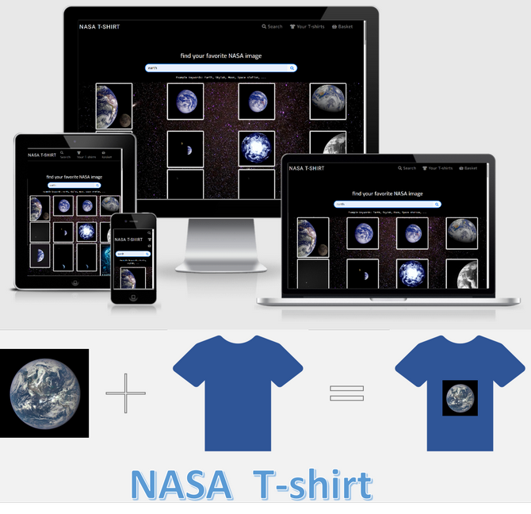
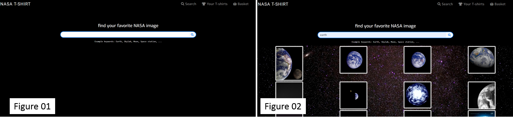
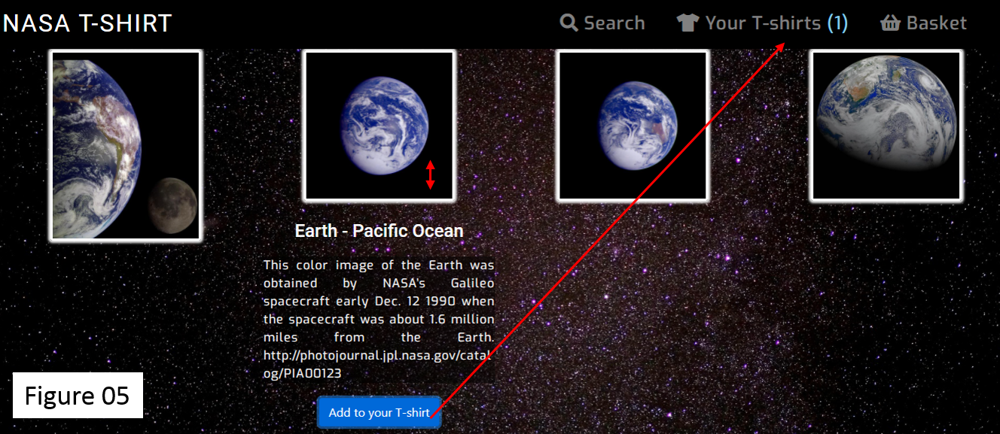
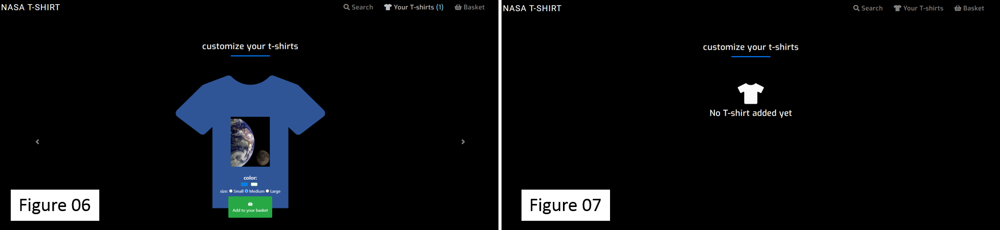
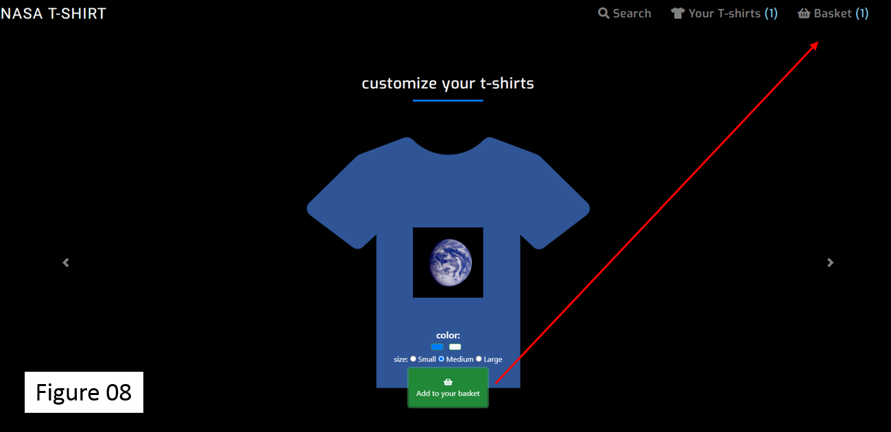
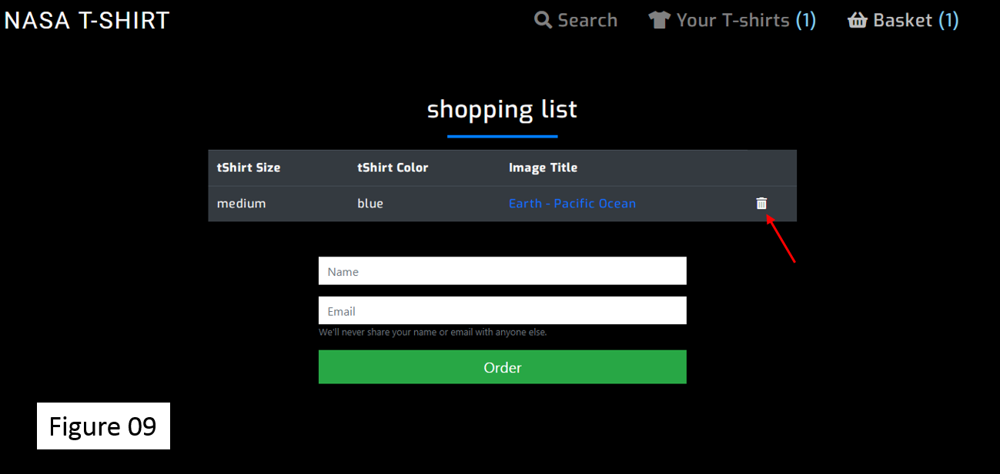
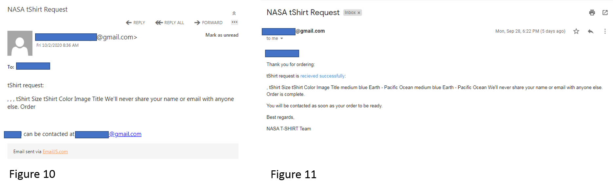
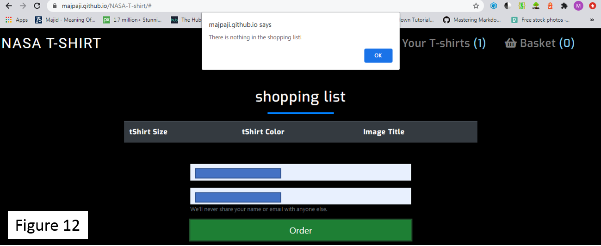
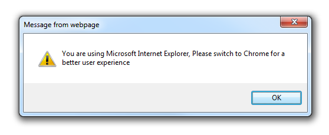

# NASA T-Shirt (Milestone project 2) 

NASA (National Aeronautics and Space Administration) is a well-known U.S. space program agency, which runs interesting projects including
Apollo Moon landing missions, Skylab space station, MARS exploration, and many other fun projects. One of the aims of NASA always makes their 
achievements available for people and makes it especially interesting for the new generation and young people. So, what could be better than 
having a T-shirt which has a NASA picture on it, and you have learned about it before you put it on your T-Shirt? this feels awesome.

This website aims to make it possible that you can search and choose the picture that you would like from NASA public shared images, also 
learn a few words about the picture, and put it on your customized T-shirt that fits the best.

## UX

This website could increase people's knowledge about NASA organizations and their projects. This website could be useful for everybody, 
but it would be especially good for young generations. 
Or else, it could be for clothing-retail companies to sell new T-shirt designs. In this business model, people design their t-shirt that could be interesting for them.

This website is consisting of three main sections. In the first section, it is possible to search in the NASA image database 
with different keywords, to find the desired image, then you learn about the picture. If you find it exciting, choose it as your T-shirt picture. In the second section, 
it is possible to select the size and color of the T-shirt and then add them to your shopping basket. In the last part, user order T-shirts via his/her email.

During each search session, it is possible to come back to the search section and add more images to your T-shirt depository. 
Also, it is possible to remove/add a T-shirt on your shopping list. It makes the webpage more responsive and interactive with the users.

Here some user stories:

* As a communication manager at NASA, I am happy with this website because it shows to people and especially young teenagers about many projects that we are running at NASA.

* As a person who does a lot of cloth online shopping, this website allows me to design my favorite T-shirt.

The wireframe for the NASA T-shirt can be found in the following [link](wireframes/wireframe.jpg).

## Features

This project is going to be consist of three main sections:

1. Home page (search page)
2. T-shirts 
3. Shopping basket

## Existing Features

1. Home page (search page)

On the home page, the user can search for NASA pictures through a REST API provided with NASA for free public use. 
Users can use any desire keywords and get a response if there is an image related to them. 
They get information as a title and some description for each picture by clicking on it. Then, they can choose and add them to the T-shirts section.

2. T-shirts

In this section, users can look through selected images demonstrated on the default color (blue) and size (Medium) of the T-shirts. 
It is possible to change the background color of the T-shirt and the size of the T-shirt. Afterward, users can add a customized T-shirt 
to the shopping basket. Also, in this section is possible to come back to the home page (search) section to add more image to the T-shirt section.

3. Shopping basket

In the shopping section, it is possible to see a summary of the order list in the table format. It is possible to remove items if the users change his/her mind. 
It is also possible to come back to the T-shirts section to add more T-shirts. The order is going to be done through an email 
API which the users provide a name and email address. After ordering, the users and owner of the website receive a confirmation email regarding the order.

## Features Left to Implement

There are several possible features to implement. They are listed, respectively:

1.	Increase the number of images coming from the NASA image API, which will give more choices to the users.
2.	Give possibilities in which users can add text to the T-shirt.
3.	Add other features that images can be added to them like coffee cup, hat , and etc.

## Technologies Used

The following technologies have been used in this project:
* HTML5
    * Used to structure and presenting the content.
* CSS3
    * Used for styling.
* JavaScript
    * JavaScript was supposed to be the hero of this project
* [JQuery](https://jquery.com/)
    * This project used JavaScript in the form of JQuery to simplify DOM manipulation.
* [EmailJS](https://www.emailjs.com/)
    * JavaScript API to send email directly from it.
* [Bootstrap4](https://getbootstrap.com/)
    * CSS framework used for structuring and presenting the content.
* [Fontawsome](https://fontawesome.com/)
    * Used to create icons.
* [Google font](https://fonts.google.com/)
    * Used for formatting the fonts.

## Testing

This was achieved with following sections:

1. Search you keyword

Users can write any keywords to search in the NASA database, some example keywords written under the search box for guidance, 
e.g. Earth, Skylab, Moon, Space station **(Figure 01)**. The responses from the NASA database will represent with background of a sky full of stars and planets **(Figure 02)**.

If users do not write any keyword and submit an empty box. The response will be that “Please search some words” **(Figure 3)**. 
In the case of nothing could be found for the searched keywords. The response with being that “Nothing found for your keywords” **(Figure 4)**.

2. Learning about the pictures and adding to your T-shirt

Users can learn more about each picture by clicking on it. It is good to mention that mouse shape changes by going over the picture 
to give some toggle action indication. Then users can add the image to the T-shirt section and a number appears in Your T-shirs section 
indicating the number of the images added in this section **(Figure 5)**.

3. Choose the color and size of your T-shirt

In this part, users can choose the background color of the T-shirt as blue or white. It is also possible to change the size **(Figure 6)**. 
The next T-shirt can be seen with pushing the arrow to the left or right. It is good to mention that color and size of the T-shirt change 
according to the user choice to increase the responsive design of the web page. It is good to note if there is nothing in this 
section a “No T-shirt added yet” message will be displayed on the page **(Figure 7)**.

4. Adding the T-shirt to your shopping basket

After customizing the T-shirt, it can be added to the shopping basket and a number appears 
in the Basket section showing the number of T-shirts added into the basket **(Figure 8)**.

5. Make an order

In the basket section, it is possible to see the shopping list. The shopping items are represented with size, color, and title of the image 
(which can be clicked for a better view). The items can be deleted from the list by clicking on the trash basket **(Figure 9)**.

Then users should provide a name and email address to make the order complete. If users do not provide and name or valid email 
relevant error message appears. A message appears regarding the success or failure in the order procedure. In submitting an order, 
one email sends to the NASA T-shirt team to put the order and the email of the buyer is provided for future contact. Also, another email 
sends it to the user to confirm the ordering **(Figure 10 and Figure 11)**. 

After order submission, the order button disappears to prevent not 
necessarily multiple ordering. In the case of the user remove all the items from the shopping list and wants to submit the empty shopping list, 
an alert will appear “There is nothing in the shopping list!” and the order will not be submitted **(Figure 12)**.

## Website validation

1. Different validation services

The HTML part was validated with [Markup Validation Service W3C®](https://validator.w3.org/) without any major problem. 
There was some issue with having whitespace and non-hidden form control for attribute on element label which was resolved.
 Also, there is a warning regarding the type attribute for JavaScript resources. 
 Result can be seen in the following [link](testing/validation/Markup-validation-service-HTML.PNG).

 The [W3C CSS](http://www.css-validator.org/) validation service was used for CSS part. There was no problem regarding CSS validating. 
 Results can be seen in following [link](testing/validation/Markup-validation-service-CSS.PNG).

 [JS hint](https://jshint.com/) used for validation of JavaScript. There were just warning regarding different part only available for ES6.

 2. Website validation of different browsers

The website was tested on:

* Google chrome
    * There was no issue. The results can be seen in the following [link](testing/validation/chrome_testing.pdf).
* Firefox
    * There was no issue. The results can be seen in the following [link](testing/validation/firefox_testing.pdf).
* Opera
    * There was no issue. The results can be seen in the following [link](testing/validation/opera_testing.pdf).
* Internet explorer
    * Internet explorer had issue rendering the website. Therefore, an alert message added that user need to switch to other explorer for better user experience.

    

* Microsoft edge
    * There was no issue. The results can be seen in the following [link](testing/validation/edge_testing.pdf).
* Iphone 8
    * There was no issue. The results can be seen in the following [link](testing/validation/iphone8_testing.pdf).
* Samsung S8
    * There was no issue. The results can be seen in the following [link](testing/validation/samsungS8_testing.pdf).

## Deployment

### GitHub

The project can be deployed to GitHub Pages using following steps:
1.	Log in to GitHub and locate the GitHub Repository.
2.	At the top of the Repository, click on the "Settings" button on the menu.
3.	Locate the "GitHub Pages" Section.
4.	Under "Source", click the dropdown called "None" and select "Master Branch".
5.	The page will automatically refresh.
6.	Scroll back down through the page to locate the now published site link in the "GitHub Pages" section.

### Local Clone

It is possible to make a copy of the repository on your computer using local clone. This can be done using following steps:
1.	Log in to GitHub and locate the GitHub Repository.
2.	Under the repository name, locate the "download code" button.
3.	To clone the repository using HTTPS, under "Clone with HTTPS", copy the link.
4.	Open Git Bash
5.	Change the current working directory to the location where you want the cloned directory to be made.
6.	Type git clone, and then paste the URL you copied in Step 3.

> $ git clone https://github.com/MajPaji/NASA-T-shirt.git

7.	Press Enter.

### Forking the GitHub

It is possible to make a copy of the original repository and request for changing repository owner through a pull request.
 I order to forking GitHub repository, one should make following steps:

1.	Log in to GitHub and locate the GitHub Repository
2.	At the top of the Repository and not top of the page just above the "Settings" button on the menu, locate the "Fork" button.
3.	Then there is a copy of the original repository in your GitHub account.

## Content

The text description for NASA images are from https://api.nasa.gov/

## Media

The NASA photos used in this site were obtained from https://api.nasa.gov/

## Acknowledgements

I acknowledge Gerry (my mentor) guidance on this project.

